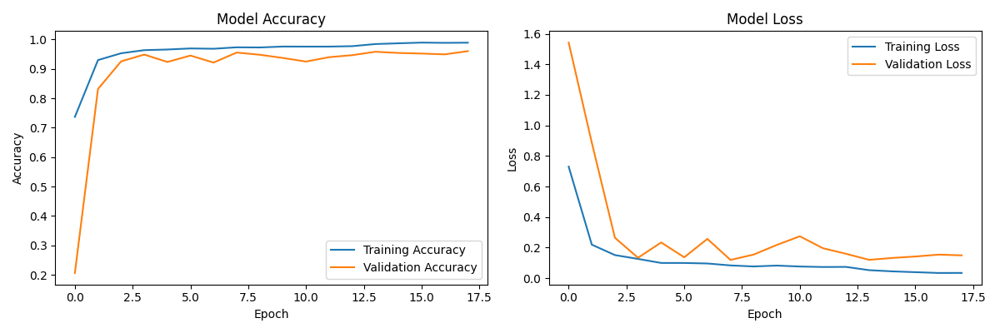

# 🏃‍♂️ Human Activity Recognition using CNN-LSTM 🏃‍♀️

This project implements a deep learning model that combines **Convolutional Neural Networks (CNN) 🧠** and **Long Short-Term Memory (LSTM) ⏳** networks to classify human activities using **smartphone sensor data 📱**. The model is trained on the **UCI HAR (Human Activity Recognition) Dataset 📊**.

## 🌟 Project Overview  

The system classifies human activities based on **accelerometer** and **gyroscope** data into six categories:
✅ Walking 🏃‍♂️  
✅ Walking Upstairs ⬆️  
✅ Walking Downstairs ⬇️  
✅ Sitting 🪑  
✅ Standing 🏃  
✅ Laying 🛏️  

---

## 🏢 Model Architecture  

The model combines **CNN** for spatial feature extraction and **LSTM** for temporal pattern recognition:  

🔹 **CNN Layers 🎨**:  
   - Two convolutional blocks with increasing filter sizes **(64, 128)**  
   - Each block includes **BatchNormalization** and **MaxPooling**  
   - Helps extract spatial features from the sensor data  

🔹 **LSTM Layers 🔄**:  
   - Two LSTM layers **(128 and 64 units)**  
   - Includes **BatchNormalization** and **Dropout** for regularization  
   - Captures temporal dependencies in sequence data  

🔹 **Dense Layers 🎯**:  
   - Fully connected layers for classification  
   - Output layer with **softmax activation** for 6-class classification  

---

## 📊 Training Results  

🖼️ **Training History Plot:**  
  

This plot displays model **accuracy 📈** and **loss 📉** for both **training and validation** sets.  

---

## 💽 Dataset  

📌 The **UCI HAR Dataset** contains smartphone sensor data collected from **30 subjects** performing different activities. The dataset is split into:  
🔹 **Training Set (70%)**  
🔹 **Test Set (30%)**  

Each data sample includes:  
🔹 **Triaxial acceleration** from the accelerometer  
🔹 **Triaxial angular velocity** from the gyroscope  
🔹 **561-feature vector** with time and frequency domain variables  
🔹 **Activity label**  
🔹 **Subject identifier**  

---

## 📦 Requirements  

```bash
numpy  
pandas  
scikit-learn  
tensorflow  
matplotlib  
```

---

## ⚙️ Installation  

1️⃣ Clone this repository:  
```bash
git clone https://github.com/MohamedElmogy25/LSTM  
cd LSTM  
```  

2️⃣ Install required dependencies:  
```bash
pip install -r requirements.txt  
```  

3️⃣ Download the **UCI HAR Dataset** and place it in the project directory.  

---

## 🚀 Usage  

📌 Make sure the dataset is placed correctly in the project directory.  

Run the training script:  
```bash
python har_cnn_lstm.py  
```

This script will:  
✅ Load and preprocess the data 📂  
✅ Train the **CNN-LSTM** model 🏋️‍♂️  
✅ Generate training history plots 📊  
✅ Save the trained model 💾  

---

## 📊 Model Performance  

🏆 The model achieves **high accuracy** in classifying human activities:  
✅ **Training accuracy**: Tracked in the training history plot  
✅ **Validation accuracy**: Monitored during training  
✅ **Test accuracy**: Final evaluation on the test set  

---

## 📢 Contributing  

💡 Contributions are welcome! Feel free to **submit a Pull Request** or **open an issue** in the repository.  

---

## 📝 License  

📄 This project is licensed under the **MIT License** – see the **LICENSE** file for details.  

---

## 🙌 Acknowledgments  

🎯 **Special thanks to:**  
- 📊 UCI HAR Dataset providers  
- 🛠️ TensorFlow and Keras documentation  
- 🔬 The scientific computing community for their excellent tools and libraries  

---

## 📩 Contact  

For **questions** or **feedback**, please **open an issue** in the repository.   
